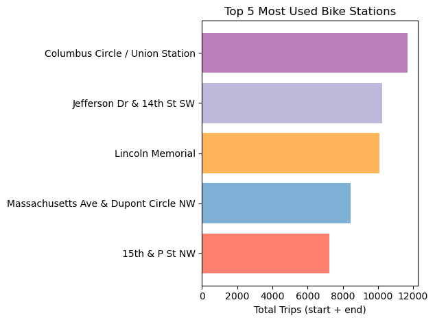

## Original Project Instructions from Udacity
>**Note**: Please **fork** the current Udacity repository so that you will have a **remote** repository in **your** Github account. Clone the remote repository to your local machine. Later, as a part of the project "Post your Work on Github", you will push your proposed changes to the remote repository in your Github account.

### Date created
This README file was created on 6/10/25.
The project itself was developed in May of 2025.

### Project Title
Exploration of US Bikeshare Data

### Description
This Python program loads, filters, displays data (on request) and computes statistics on bikeshare data 
for Chicago, New York City, and Washington, DC based on user inputs.

## Table of Contents
1. [Prerequisites](#prerequisites)  
2. [Installation](#installation)  
3. [Instructions and Explanations](#instructions-and-explanations)  
4. [Files used](#files-used)  
5. [Project Structure](#project-structure)  
6. [Credits](#credits)  

### Prerequisites
- Python 3.7+
- pandas, NumPy, matplotlib (`pip install -r requirements.txt`)

## Installation
```bash
git clone https://github.com/ivanzindc/pdsnd_github.git
cd pdsnd_github
pip install -r requirements.txt
```

### Instructions and Explanations

Please run the script in the terminal and follow the prompts.

I added a matplotlib visualization of busiest locations for chosen filters.
It will be produced in a separate window if your terminal allows GUI.

### Demo
```
$ python bikeshare_2.py
Hello! Let's explore some US bikeshare data!
Please enter the city: Washington
Please enter the desired month or 'all' if you would like to include all months:
 all
Please enter the desired weekday or 'all': all
----------------------------------------
Would you like to see 5 lines of raw data?y
   Unnamed: 0          Start Time  ... day_of_week  hour
0     1621326 2017-06-21 08:36:34  ...           2     8
1      482740 2017-03-11 10:40:00  ...           5    10
2     1330037 2017-05-30 01:02:59  ...           1     1
3      665458 2017-04-02 07:48:35  ...           6     7
4     1481135 2017-06-10 08:36:28  ...           5     8

[5 rows x 10 columns]
Would you like to see 5 more lines of raw data?y
   Unnamed: 0          Start Time  ... day_of_week  hour
5     1148202 2017-05-14 07:18:18  ...           6     7
6     1594275 2017-06-19 08:41:43  ...           0     8
7     1601832 2017-06-20 05:54:42  ...           1     5
8      574182 2017-03-24 20:37:00  ...           4    20
9      327058 2017-02-20 21:12:00  ...           0    21

[5 rows x 10 columns]
Would you like to see 5 more lines of raw data?n

Calculating The Most Frequent Times of Travel...

The most common month is: June
The most common weekday is: Wednesday
The most common hour is: 8:00

This took 0.17440176010131836 seconds.
----------------------------------------

Calculating The Most Popular Stations and Trip...

The most common start station is: Columbus Circle / Union Station
The most common end station is: Columbus Circle / Union Station
The most common origin-destination pair is: Jefferson Dr & 14th St SW - Jefferson Dr & 14th St SW

This took 0.14265990257263184 seconds.
----------------------------------------

Calculating Trip Duration...

Total travel time is: 103,106 hr and 39 min
Average travel time is: 0 hr and 20 min

This took 0.01581263542175293 seconds.
----------------------------------------

Calculating User Stats...

User Type
Subscriber    220,786
Customer       79,214
Name: count, dtype: object

This took 0.0 seconds.
----------------------------------------
The five busiest locations are:
  Columbus Circle / Union Station: 11,704
  Jefferson Dr & 14th St SW: 10,240
  Lincoln Memorial: 10,079
  Massachusetts Ave & Dupont Circle NW: 8,429
  15th & P St NW: 7,252

Would you like to restart? Enter yes or no.
no
```

This is the plot for unfiltered NYC data in a demo run above:



*Figure: Combined start+end trip counts for the five busiest stations.*

### Files used
Data for queries resides in 3 files:
- chicago.csv
- new_york_city.csv
- washington.csv

Udacity specifically asked not to upload working datasets 
(Randomly selected data for the first six months of 2017 for all three cities) 
to github, but similar datasets live on:

- [Capital Bikeshare](https://capitalbikeshare.com/system-data)
- [Citi Bike NYC](https://citibikenyc.com/system-data)
- [DivvyBikes (for Chicago)](https://divvybikes.com/system-data)

Project template file was provided by Udacity.

### Project Structure
- **pdsnd_github/**
  - `.gitignore` # Git ignore rules
  - `bikeshare_2.py` # Main script
  - `requirements.txt` # Python dependencies
  - `README.md` # Project documentation

### Credits
Documentation and troubleshooting resources used include: 
   * [pandas documentation](https://pandas.pydata.org/)
   * [Official Python docs](https://docs.python.org/)
   * [StackOverflow](https://stackoverflow.com/)
   * [GeeksforGeeks educational portal](https://www.geeksforgeeks.org/)
